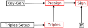

Cait-Sith is composed of multiple protocols.
For example, key generation is a separate protocol from signing.
Some protocols are broken into sub-protocols.
For example, signing is broken into three phases, the first can be
done without any secret information, the second with just the shares of the
secret key, and the final one after learning the message to sign.

This document describes the high-level orchestration of the protocols.

# Key Generation

During key generation, a set of parties $\mathcal{P}$ of size $N$ come together
to produce shares of a secret key.
These shares are such that any set $\mathcal{S} \subseteq \mathcal{P}$
of size $\geq t$ can reconstruct the secret.
We call $t$ our threshold.

# Signing

Signing is split into three phases:

1. Triple generation.
2. Presigning.
3. Signing.

Each of these phases can potentially use a different set of parties,
and these sets can have different sizes.
Furthermore, each phase can have a different threshold describing
how large the party set for the next phase needs to be.

Concretely, we have the following situation:

$$
\begin{matrix}
&\scriptsize{\text{Key-Gen}}
&&\scriptsize{\text{Triples}}
&&\scriptsize{\text{Presigning}}
&&\scriptsize{\text{Signing}}
\cr
&\mathcal{P} &\supseteq &\mathcal{P}_0 &\supseteq &\mathcal{P}_1 &\supseteq &\mathcal{P}_2\cr
&N &\geq &N_0 &\geq &N_1 & \geq &N_2\cr
&t &&t_0 &&t_1 &&t_2\cr
\end{matrix}
$$

Each phase has a different set of parties, with each subsequent phase
having a subset of the parties present in the previous one.
The size of each party set, $N_i$, can also vary.
The thresholds can also change, subject to the following conditions:

$$
\begin{aligned}
&N_0 \geq t\cr
&N_1 \geq t_0 \geq t\cr
&N_2 \geq t_1 \geq t
\end{aligned}
$$

In other words, the first threshold $t$ is at most $N$, and every
other threshold must be at least that large.
Otherwise, the only constraint is that each subsequent party set must
be at least as large as the previous threshold.

## Discarding information

Each phase can be run many times in advance, recording the information
public information produced, as well as the list of parties which produced it.
Then, this output is consumed by having a set of parties use it
for a subsequent phase.
It's **critical** that the output is then destroyed, so that no other
group of parties attempts to re-use that output for another phase.
In particular, the parties need some way of agreeing on which
outputs have been created and used.
If the threshold $t_i$ is such that $N_{i} \leq 2t - 1$, then it's impossible
to have two non-overlapping quorums, so if each party locally registers the
fact that an output has been used, then agreement can be had not to
use a certain output.
Otherwise, you might have two independent groups of parties trying
to use the same output, which is bad.

# Graph

Here's a figure describing the dependencies between the different phases:

<picture>
  <source media="(prefers-color-scheme: dark)" srcset="./images/dark/dependencies.svg">
  <source media="(prefers-color-scheme: light)" srcset="./images/light/dependencies.svg">
  
</picture>

The red boxes mean that the output of that phase can only be used once.
